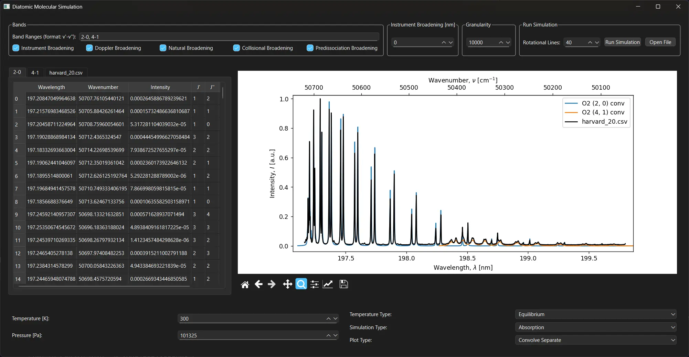

# spectra

> *Last Updated: 20 September 2023*

A simulation of the Schumann-Runge bands of molecular oxygen written in Python.

## Background

This is a simple tool for computing and displaying the spectrum of molecular oxygen for the $B^3\Sigma_u^- - X^3\Sigma_g^-$ transition. The vibrating rotator approximation is used, with up to fourth-order corrections being applied to the vibrational term value.

Diatomic constants are obtained directly from the [NIST database](https://webbook.nist.gov/cgi/cbook.cgi?ID=C7782447&Mask=1000#Diatomic). General theory and notation are explained in the included document.

Included within this tool for comparison are:

- Experimental data from the [Harvard CFA molecular database](https://lweb.cfa.harvard.edu/amp/ampdata/cfamols.html)
- Simulated data from [PGOPHER](https://pgopher.chm.bris.ac.uk/Help/makeo2.htm)
- Tabulated data from [HITRAN](https://hitran.org/lbl/3?36=on)
- Simulated data from [Cosby 1993](https://ntrs.nasa.gov/citations/19930050666)

## Features

This tool includes features for:

- Population density based on the Boltzmann distribution and total partition function
- Simulating the effects of triplet splitting

The plots can be displayed as:

- Quantized spectral line positions
- Convolved lineshapes given a measurement temperature and pressure to better match experimental data
- Comparisons with experimental or simulated data

Convolutions include the effects of:

- Thermal doppler broadening (Gaussian)
- Pressure broadening (Lorentzian)
- Natural broadening (Lorentzian)
- Predissociation broadening (Lorentzian)

The effects are all computed and convolved into an overall Voigt profile.

Since this tool only simulates the Schumann-Runge bands of $\text{O}_2^{16}$, neither the molecule nor the electronic transition can be changed. Vibrational transitions up to around $v=15$ are supported with the included Franck-Condon factor tables, but the constants currently used are only valid to around $v\approx9$. The maximum rotational quantum number is $N=35$, which is limited by the predissociation broadening data used.

## Example Spectrum

An example spectrum of $\text{O}_2^{16}$ using:

- $(v',v'')=(2,0)$
- $N_\text{max}=35$
- $T=300$ $\text{K}$
- $p=101325$ $\text{Pa}$

Convolved lineshapes are simulated and plotted against sample data from the [Harvard CFA database](https://lweb.cfa.harvard.edu/amp/ampdata/o2pub92/o2wb2x0.xsc).

## Roadmap

There is quite a bit of functionality I'd still like to add in the future, such as:

- [x] Predissociation linewidth broadening in the Lorentzian convolution
- [x] Addition of Franck-Condon factors to allow for the computation of two or more vibrational transitions at once
- [ ] Proper computation for the intensities of the triplet fine structures (right now the intensities of the fine structure levels $F_1$ and $F_3$ are set to half of the main structure $F_2$)
- [ ] Procure and implement more accurate diatomic constants
- [ ] Identify and fix issues with satellite bands not lining up with experimental data at high wavenumbers
- [ ] Add support for including the effects of laser-induced fluorescence (LIF) spectroscopy
