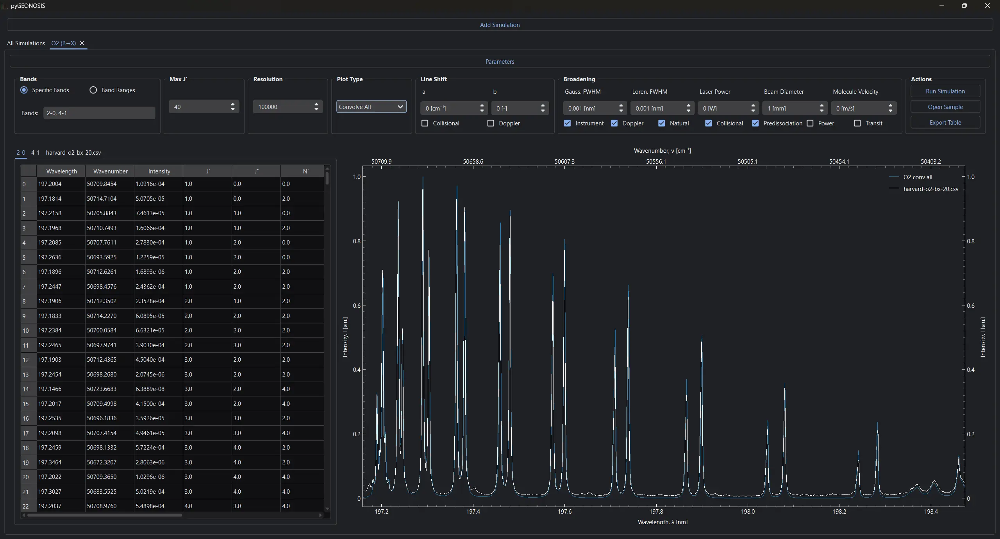

# GEDISABRES 

GEDISABRES [/ˈdʒɛdaɪ ˈseɪbɚz/](https://ipa-reader.com/?text=ˈdʒɛdaɪˈseɪbɚz&voice=Matthew) (Generalized Diatomic Simulation for Absorption and Rovibronic Emission Spectra) is a general-purpose tool for simulating the rovibronic spectra of diatomic molecules. Built using NumPy, Polars, PySide6, PyQtGraph, and SciPy, GEDISABRES is designed to be easily understood and modified.

The capabilities of this tool are briefly summarized below. More detailed theory and notation are explained in the included document.

## Background

### Rotational Hamiltonian

The rotational Hamiltonian is computed on a per-term basis according to the molecular term symbol of the molecule in question along with the supplied constants. For more information, see [hamilterm](https://github.com/nategphillips/hamilterm).

### Spectral Broadening

Convolutions include the effects of both Gaussian and Lorentzian broadening mechanisms. Each type of broadening can be toggled on or off individually.

#### Gaussian

- Doppler broadening
- Transit time broadening

#### Lorentzian

- Collisional broadening
- Natural broadening
- Power broadening
- Predissociation broadening (only O2 is supported for now)

#### Voigt

- Instrument broadening

### Equilibrium & Non-equilibrium

The translational, electronic, vibrational, and rotational temperatures can be specified separately. Boltzmann population distributions are assumed.

### Plot Types

Four plot types are currently implemented:

- Line
  - Each rotational line is plotted at its exact wavenumber.
- Line Info
  - Information is printed above each line for easier identification.
- Convolve Separate
  - The rotational lines within a single vibrational band are convolved.
- Convolve All
  - All vibrational bands are convolved together.

## Validation with Experimental Data

Data for molecular oxygen from the [Harvard-Smithsonian Center for Astrophysics](https://www.cfa.harvard.edu/) is used to verify the output of GEDISABRES. In particular, data for the [Schumann–Runge bands](https://lweb.cfa.harvard.edu/amp/ampdata/o2pub92/S-R.html) is used at 300 K. The specific bands chosen to emulate the experimental data are shown in the at the top left of the GUI in each image.

### (2, 0) Band Validation



## Installation

### From an Executable

Go to the [releases tab](https://github.com/nategphillips/GEDISABRES/releases) of this repository and download the latest compressed archive specific to your operating system. Extract the contents and run the binary file contained inside.

### From Source

On your PC, navigate to a directory of your choice and run

```bash
git clone https://github.com/nategphillips/GEDISABRES
```

to download the source code directly. This repository uses the [uv](https://github.com/astral-sh/uv) package manager for Python. Install uv using the instructions on their [website](https://docs.astral.sh/uv/). Once uv is installed, the packages required for GEDISABRES can be added in a virtual environment by navigating to the repository's root directory and installing the dependencies:

```bash
uv sync
```

Then, navigate to the `src/` directory and run the GUI:

```bash
uv run ./main.py
```

## Roadmap

### GUI Functionality

- [x] Switch to PyQtGraph instead of Matplotlib for improved plot performance
- [x] Add the ability to export rotational line data from the built-in spreadsheet
- [ ] Improve the interface for adding and removing experimental data

### Physics

- [x] Add support for more diatomic molecules, starting with $\text{NO}$
- [x] Allow for Gaussian, Lorentzian, and Voigt instrument functions
- [x] Add Doppler and collisional line shifting mechanisms
- [ ] Implement multi-species pressure broadening
- [ ] Construct a general two-level LIF model
- [ ] Include support for non-Boltzmann temperature distributions

## License and Copyright

Copyright (C) 2023-2025 Nathan G. Phillips

This program is free software: you can redistribute it and/or modify
it under the terms of the GNU General Public License as published by
the Free Software Foundation, either version 3 of the License, or
(at your option) any later version.

This program is distributed in the hope that it will be useful,
but WITHOUT ANY WARRANTY; without even the implied warranty of
MERCHANTABILITY or FITNESS FOR A PARTICULAR PURPOSE.  See the
GNU General Public License for more details.

You should have received a copy of the GNU General Public License
along with this program.  If not, see <https://www.gnu.org/licenses/>.
